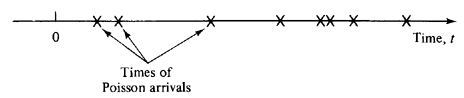

```{r setup, include=FALSE}
knitr::opts_chunk$set(echo = TRUE)
```


## The Meat 

Suppose that Americans consume an average of 2 pounds of ground beef per month.

(a) Do you expect the distribution of this measure (ground beef consumption per capita per month) to be approximately normal? Why or why not?

    The distribution of the average ground beef consumption is not expected to be normal because it can be any distribution or
    skewed any direction due to the various availability of meat in the US. 
(b) Suppose you want to take a sample of 100 people. Do you expect the distribution of the sample mean to be approximately normal? Why or why not?

    The distribution of the sample mean is expected to be normal per the central limit theorem on sample statistics.
(c) You take a random sample of 100 Berkeley students to find out if their monthly ground beef consumption is any different than the nation at large.  The mean among your sample is 2.45 pounds and the sample standard deviation is 2 pounds. What is the 95\% confidence interval for Berkeley students?
  
$$ \bar{X} \pm 1.96\cdot \frac{s}{\sqrt{n}} \\  = (2.058,2.824) $$


## GRE Scores
Assume we are analyzing MIDS students' GRE quantitative scores. We want to construct a $95\%$ confidence interval, but we *naively* uses the famous 1.96 threshold as follows:

$$ \big( \bar{X} -1.96 \cdot \frac{s}{\sqrt{n}},  \bar{X} +1.96 \cdot \frac{s}{\sqrt{n}} \big) $$

What is the real confidence level for the interval we have made, if the sample size is 10?  What if the sample size is 200? 
If the size is 10, we ought to use the t-distribution with degree of freedom of 9, the corresponding confidence level is (%)
```{r}
(2*pt(1.96,9) - 1)*100
```
When the sample size is 200 > 30, the confidence level is 95%

## Maximum Likelihood Estimation for an Exponential Distribution

A Poisson process is a simple model that statisticians use to describe how events occur over time.  Imagine that time stretches out on the x-axis, and each event is a single point on this axis.



The key feature of a Poisson process is that it is *memoryless*.  Loosely speaking, the probability that an event occurs in any (differentially small) instant of time is a constant.  It doesn't depend on how long ago the previous event was, nor does it depend on when future events occur.  Statisticians might use a Poisson process (or more complex variations) to represent:

- The scoring of goals in a world cup match
- The arrival of packets to an internet router
- The arrival of customers to a website
- The failure of servers in a cluster
- The time between large meteors hitting the Earth

In live session, we described a Poisson random variable, a discrete random variable that represents the number of events of a Poisson process that occur in a fixed length of time.  However, a Poisson process can be used to generate other random variables.

Another famous random variable is the exponential random variable, which represents the time between events in a Poisson process.  For example, if we set up a camera at a particular intersection and record the times between car arrivals, we might model our data using an exponential random variable.

The exponential random variable has a well-known probability density function,

$$ f(x|\lambda) = \lambda e^{-\lambda x} $$

Here, $\lambda$ is a parameter that represents the rate of events.

Suppose we record a set of times between arrivals at our intersection, $x_1, x_2, ... x_n$.  We assume that these are independent draws from an exponential distribution and we wish to estimate the rate parameter $\lambda$ using maximum likelihood.

Do this using the following steps:

a. Write down the likelihood function, $L(\lambda)$.  Hint: We want the probability (density) that the data is exactly $x_1, x_2,...,x_n$.  Since the times are independent, this is the probability (density) that $X_1 = x_1$, times the probability (density) that $X_2 = x_2$, and so on.

$$L(\lambda) = \prod_{i= 1}^{n}\lambda e^{-\lambda x_i} = \lambda^n e^{-\lambda  \sum_{i=1}^{n}x_i} $$

b. To make your calculations easier, write down the log of the likelihood, and simplify it.
$$ \log(L(\lambda)) = n\log(\lambda) - \lambda \sum_{i=1}^{n}x_i$$

c. Take the derivative of the log of likelihood, set it equal to zero, and solve for $\lambda$.  How is it related to the mean time between arrivals?
$$\frac{d}{d_\lambda}(\log(L(\lambda)) = \frac{n}{\lambda} - \sum_{i=1}^{n}x_i = 0 \\ \hat\lambda_{MLE} = \frac{n}{\sum_{i=1}^{n}x_i}$$

d. Suppose you get the following vector of times between cars:

```{r}
times = c(2.65871285, 8.34273228, 5.09845548, 7.15064545,
          0.39974647, 0.77206050, 5.43415199, 0.36422211,
          3.30789126, 0.07621921, 2.13375997, 0.06577856,
          1.73557740, 0.16524304, 0.27652044)
```

Use R to plot the likelihood function.   Then use optimize to approximate the maximum likelihood estimate for $\lambda$.  How does your answer compare to your solution from part c?

```{r}
likelihood = function(lambda){
  log(lambda)*length(times) - lambda*sum(times)
}
curve(likelihood,from=0, to = 10)
```

The solution for the MLE of lambda is about the same for part c and from the optimize function. The optimize function yielded a slightly larger value at the 5th decimal point.

```{r}
optimize(likelihood, interval = c(0,10), maximum = TRUE)

length(times)/sum(times)

```