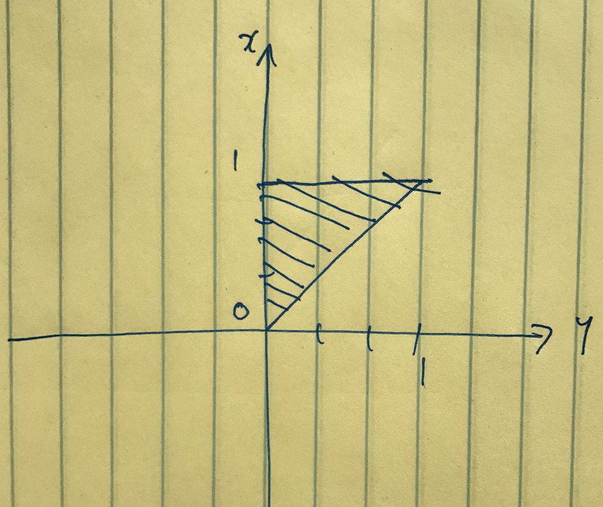

# 1. Meanwhile, at the Unfair Coin Factory...

You are given a bucket that contains 100 coins.  99 of these are fair coins, but one of them is a trick coin that always comes up heads.  You select one coin from this bucket at random.  Let T be the event that you select the trick coin.  This means that $P(T) = 0.01$.

a. To see if the coin you have is the trick coin, you flip it $k$ times.  Let $H_k$ be the event that the coin comes up heads all $k$ times.  If you see this occur, what is the conditional probability that you have the trick coin?  In other words, what is $P(T|H_k)$.

Let $P(NT)$ be the probability of getting a fair coin from the 100 coins. Then:

$$
P(T|H_k) = \frac{P(H_k|T)P(T)}{{P(H_k|NT)*P(NT)} + P(H_k|T)*P(T)}\\
\\
=\frac{1*0.01}{0.5^k*0.99 + 1*0.01}
$$
b. How many heads in a row would you need to observe in order for the conditional probability that you have the trick coin to be higher than 99%?
$$ P(T|H_k) > 0.99\\
=> k \ge 13.25\\
=> k \ge 14
$$
                        
# 2. Wise Investments 

You invest in two startup companies focused on data science.  Thanks to your growing expertise in this area, each company will reach unicorn status (valued at $1 billion) with probability 3/4, independent of the other company.  Let random variable $X$ be the total number of companies that reach unicorn status.  X can take on the values 0, 1, and 2.  Note: $X$ is what we call a binomial random variable with parameters $n=2$ and $p=3/4$.

a. Give a complete expression for the probability mass function of $X$.
$$
f(x) = \begin{cases}
P(X = 0) = \frac{1}{16}\\
P(X = 1) = \frac{6}{16}\\
P(X = 2) = \frac{9}{16}
\end{cases}
$$
b. Give a complete expression for the cumulative probability function of $X$.
$$
F(x) = \begin{cases}
0 & X < 0\\
\frac{1}{16} & 0 \le X<1\\
\frac{7}{16} & 1 \le X<2\\
1 &X\ge2
\end{cases}
$$
c. Compute $E(X)$.
$$
E(X) = \sum x\cdot f(x) = 1.5
$$
d. Compute $var(X)$.
$$
V(X) = E(X^2) - E(X)^2 = \frac{21}{8} - 1.5^2 = 0.375$$
# 3. Relating Min and Max

Continuous random variables $X$ and $Y$ have a joint distribution with probability density function,

$$ f(x,y) = \begin{cases}
2, &0 < y < x < 1 \\
0, &otherwise.
\end{cases} $$

You may wonder where you would find such a distribution.  In fact, if $A_1$ and $A_2$ are independent random variables uniformly distributed on $[0,1]$, and you define $X = max(A_1,A_2)$, $Y = min(A_1,A_2)$, then $X$ and $Y$ will have exactly the joint distribution defined above.

a. Draw a graph of the region for which $X$ and $Y$ have positive probability density.


b. Derive the marginal probability density function of $X$, $f_X(x)$.

$$f_X(x) = \int_{-\infty}^\infty f_{X,Y}(x,y)dy = \int_0^x 2dy = 2x\\
$$
$$
f_X(x) = \begin{cases}
2x & 0<x<1\\
0 & otherwise
\end{cases}
$$


c. Derive the unconditional expectation of $X$.

$$ 
E(X) = \int x \cdot f_X(x)\\
=\int_0^1 x\cdot 2xdx \\
= \frac{2}{3}x^3|_0^1
=\frac{2}{3} $$
d. Derive the conditional probability density function of $Y$, conditional on $X$, $f_{Y|X}(y|x
$$
f_{Y|X}(y|x) = \frac{f_{X,Y}(x,y)}{f_X(x)} = \frac{1}{x}\\
0 \le x \le 1$$
e. Derive the conditional expectation of $Y$, conditional on $X$, $E(Y|X)$.

$$E(Y|X) = \int_0^xy\cdot f_{Y|X}(y|x) = \frac{x}{2}$$

f. Derive $E(XY)$.  Hint: if you take an expectation conditional on $X$, $X$ is just a constant inside the expectation.  This means that $E(XY|X) = XE(Y|X)$.
$$ E(XY) = E(E(XY|X)) = E(XE(Y|X)) = E(X \cdot \frac{X}{2}) = \frac{1}{2}E(X^2)\\
=\frac{x^4}{4}|_0^1 = \frac{1}{4}$$

g. Using the previous parts, derive $cov(X,Y)$
$$E(Y) = E(E(Y|X)) = E(\frac{X}{2}) = \frac{x^3}{3}|_0^1=\frac{1}{3}$$
$$ cov(X,Y) = E(XY) - E(X)E(Y) = \frac{1}{4} -\frac{2}{3}\cdot \frac{1}{3} = \frac{1}{36}$$

# 4. Circles, Random Samples, and the Central Limit Theorem

Let $X_1, X_2,...,X_n$ and $Y_1,Y_2,...,Y_n$ be independent random samples from a uniform distribution on $[-1,1]$.  Let $D_i$ be a random variable that indicates if $(X_i,Y_i)$ falls within the unit circle centered at the origin.  We can define $D_i$ as follows:

$$ D_i = \begin{cases}
1, &X_i^2 + Y_i^2 < 1 \\
0, &otherwise
\end{cases}
$$

Each $D_i$ is a Bernoulli variable.  Furthermore, all $D_i$ are independent and identically distributed.

a. Compute the expectation of each indicator variable, $E(D_i)$.  Hint: your answer should involve a Greek letter.
$$E(D_i) = \int_{-\infty}^\infty D_i\cdot P(D_i) = 1\cdot P(1) = \frac{Area( X_i^2 + Y_i^2 =1) }{Area(Sample Space)} = \frac{\pi}{4} = 0.7853982 $$

b. Compute the standard deviation of each $D_i$.
$$\sigma_{D_i} = \sqrt{E(D_i^2) - E(D_i)^2}= \sqrt\frac{4\pi-\pi^2}{16}$$
c. Let $\bar{D}$ be the sample average of the $D_i$.  Compute the standard error of $\bar{D}$.  This should be a function of sample size $n$.
$$ se = \frac{\sigma_{D_i}}{\sqrt{n}} $$

d. Now let n=100.  Using the Central Limit Theorem, compute the probability that $\bar{D}$ is larger than $3/4$.  Make sure you explain how the Central Limit Theorem helps you get your answer.

$$ P(\bar{D} \ge \frac{3}{4}) = P (Z \ge \frac{\frac{3}{4}-E(D_i)}{se}) = 1 - P(Z \le -0.86) = 0.806$$
The sample size is 100, which is larger than 30 and we can use CLT that $\bar{D}$ follows a normal distribution. 
We can compute the Z-value and estimate the coressponding probability i.e. area under the curve.
```{r}
#code
sigma = sqrt(4*pi - pi^2)/4
se = sigma/10
Z = (3/4 - pi/4)/se
print(Z)
probability = 1 - pnorm(Z)
print(probability)
```
e. Now let $n=100$.  Use R to simulate a draw for $X_1, X_2,...,X_n$ and $Y_1,Y_2,...,Y_n$.  Calculate the resulting values for $D_1, D_2,...D_n$.  Create a plot to visualize your draws, with $X$ on one axis and $Y$ on the other.  We suggest using a command like the following to assign a different color to each point, based on whether it falls inside the unit circle or outside it.  Note that we pass $d+1$ instead of $d$ into the color argument because 0 corresponds to the color white.

```{r, eval=FALSE}
x = runif(100,min=-1,max = 1)
y = runif(100,min=-1,max = 1)
d = x^2 + y^2 <1
plot(x,y, col=d+1, asp=1)
```


f. What value do you get for the sample average, $\bar{D}$?  How does it compare to your answer for part a?

```{r}
x = runif(100,min=-1,max = 1)
y = runif(100,min=-1,max = 1)
d = x^2 + y^2 <1
mean(d)
```

The sample average fluctuates around the result of part a.

g. Now use R to replicate the previous experiment 10,000 times, generating a sample average of the $D_i$ each time.  Plot a histogram of the sample averages.
```{r}
getaverage = function(size){
x = runif(size, min = -1, max = 1)
y = runif(size, min = -1, max = 1)
d = x^2 + y^2 < 1
return(mean(d))
}
experiment = replicate(10000,getaverage(100))
hist(experiment, main = "Sampling Distribution of Mean D", xlab = "Sample Mean")
```


h. Compute the standard deviation of your sample averages to see if it's close to the value you expect from part c.
```{r}
std_deviation_expr = sd(experiment)
print(std_deviation_expr)
std_deviation_calculated = 1/4*sqrt(4*pi - pi^2)/10
print(std_deviation_calculated)
```
The two values are almost identical.

i. Compute the fraction of your sample averages that are larger that $3/4$ to see if it's close to the value you expect from part d.
```{r}
sum(experiment > 0.75)/10000
```
This value is close to our calculated value of 0.806 in part d.


